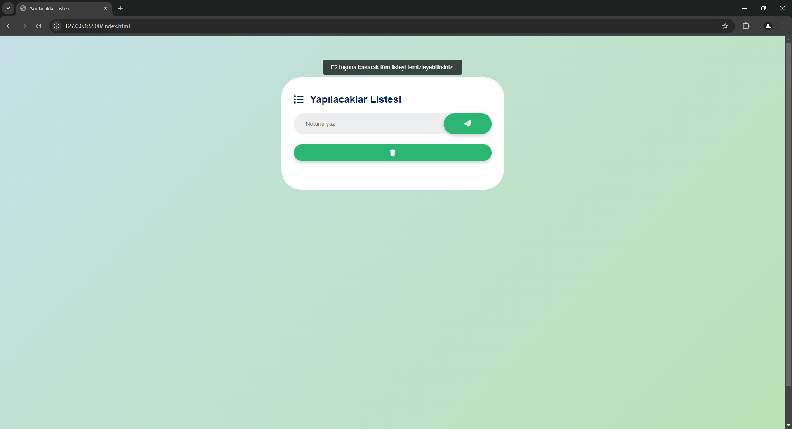
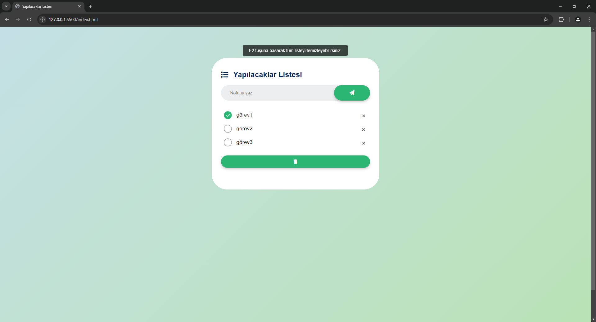

# 🌿 Yapılacaklar Listesi Uygulaması

Bu proje, kullanıcıların yapılacak işler listesi oluşturmasına, düzenlemesine ve tamamlanan işleri işaretlemesine olanak tanıyan basit bir yapılacaklar listesi uygulamasıdır. Kullanıcı dostu arayüzü ve klavye kısayolları ile üretkenliğinizi artırmak üzere tasarlandı. Pastel tonlardaki arayüz, göz yormadan kullanım deneyimi sunuyor.

## Özellikler

- ✅ Görev ekleyin ve tamamlanan işleri işaretleyin
- 🗑️ Tüm görevleri tek bir tuşla temizleyin
- ⌨️ Klavye kısayolları ile hız kazanın
- 🎨 Pastel renklerle tasarlanmış kullanıcı dostu arayüz
- 💾 Görevleriniz tarayıcıda saklanır (localStorage ile kalıcı veri depolama)

## Klavye Kısayolları

- **Enter Tuşu:** Yeni görev ekler
- **F2 Tuşu:** Tüm listeyi temizler

## Kullanım

1. Uygulamayı tarayıcınızda açın.
2. Metin kutusuna görevlerinizi yazın ve `Enter` tuşuna basarak listeye ekleyin.
3. Görevleri tamamladığınızda üzerine tıklayarak işaretleyin.
4. Tüm görevleri temizlemek için `F2` tuşunu kullanabilirsiniz.

## Ekran Görüntüleri

## 🤝 Katkıda Bulunma

Katkılarınızı bekliyoruz! Bu projeyi geliştirmek için pull request gönderin veya bir issue açarak önerilerinizi paylaşın.

## 📝 Lisans

Bu proje MIT Lisansı ile lisanslanmıştır.

## 📱 Beni Takip Edin

- **LinkedIn:** [Yusuf Gül]([https://www.linkedin.com/in/yusuf-gul](https://www.linkedin.com/in/yusufgul/))
- **Instagram:** [@yusufgul]([https://www.instagram.com/yusufgul](https://www.instagram.com/yyusufgull/?hl=tr))

---

Yeni fikirler ve geri bildirimleriniz için bana ulaşabilirsiniz. Keyifli kodlamalar! 🎉

